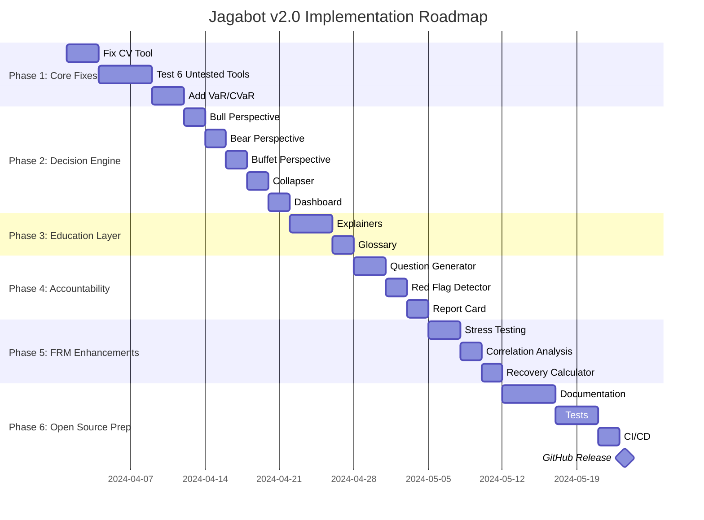

📋 SCOPE PROMPT: Jagabot v2.0 Complete Audit & Integration Plan

```markdown
# SCOPE: Jagabot v2.0 - Complete System Audit & Open Source Readiness

## SITUATION
Jagabot is a financial risk management tool built on nanobot architecture with 8 specialized engines. Current status:
- ✅ Monte Carlo working (29% probability with CI)
- ✅ Visualization working (ASCII charts + markdown dashboards)
- ⚠️ Financial CV tool needs parameter fix
- ⚠️ 6 other tools untested (Bayesian, Statistical, Early Warning, Counterfactual, Sensitivity, Pareto)
- 🆕 Need to add 3-perspective decision engine (Bull/Bear/Buffet)
- 🆕 Need to add Education & Accountability layers
- 🆕 Need to prepare for open source release

## OBJECTIVE
Conduct a COMPLETE audit of Jagabot's current state and create a comprehensive integration plan that:

1. **AUDIT CURRENT STATE** - Document EVERY component, what works, what doesn't
2. **DESIGN INTEGRATION ARCHITECTURE** - How all 40+ upgrades fit together
3. **CREATE OPEN SOURCE PACKAGE** - Structure for GitHub release
4. **PROVIDE ROADMAP** - Phased implementation plan

## AUDIT REQUIREMENTS

### PART A: Codebase Audit
Examine and document:

```

1. File Structure
   ├── jagabot/agent/tools/ - All 8 tools (Monte Carlo, CV, Bayesian, etc.)
   ├── jagabot/agent/core.py - Main agent logic
   ├── jagabot/agent/prompts/ - System prompts
   ├── jagabot/cli/ - Command line interface
   ├── tests/ - Test files
   └── requirements.txt - Dependencies
2. For EACH tool, document:
   · Current functionality (working/partial/broken)
   · Input/output schema
   · Dependencies
   · Test coverage
   · Integration with agent
   · Error handling
   · Documentation
3. For the agent, document:
   · Tool calling logic
   · Context management
   · Session handling
   · Memory usage
   · Response formatting
   · Multi-language support (Malay/English)

```

### PART B: Architecture Audit

```python
# Map current architecture
CURRENT_JAGABOT = {
    'core_engines': ['monte_carlo', 'cv', 'bayesian', 'statistical', 
                     'early_warning', 'counterfactual', 'sensitivity', 'pareto'],
    'working': ['monte_carlo', 'visualization'],
    'partial': ['cv'],
    'untested': ['bayesian', 'statistical', 'early_warning', 
                 'counterfactual', 'sensitivity', 'pareto'],
    'missing': ['var', 'cvar', 'stress_test', 'correlation', 'recovery_time'],
    'integration': {
        'mcp': 'not implemented',
        'a2a': 'not implemented',
        'api': 'not implemented'
    }
}
```

PART C: Open Source Readiness Audit

Check each for open source readiness:

```
📦 Repository Structure
   ├── README.md (exists? complete?)
   ├── LICENSE (MIT recommended)
   ├── CONTRIBUTING.md
   ├── CODE_OF_CONDUCT.md
   ├── SECURITY.md
   ├── CHANGELOG.md
   ├── examples/
   ├── docs/
   ├── tests/
   └── requirements.txt

📚 Documentation Needs
   ├── Installation guide
   ├── Quick start tutorial
   ├── Tool documentation (8 engines)
   ├── API reference
   ├── Malay language guide
   ├── FRM concepts explained
   └── Contribution guide

🧪 Testing Needs
   ├── Unit tests for each tool
   ├── Integration tests
   ├── Test data
   └── CI/CD pipeline (GitHub Actions)

🔒 Security Needs
   ├── API key handling
   ├── Input validation
   ├── Rate limiting
   └── Dependency scanning
```

INTEGRATION DESIGN

Design how ALL phases fit together:

```python
# Proposed Architecture
JAGABOT_V2 = {
    'layer_1_core': {
        'engines': ['monte_carlo', 'cv', 'bayesian', 'statistical', 
                   'early_warning', 'counterfactual', 'sensitivity', 'pareto',
                   'var', 'cvar', 'stress_test', 'correlation', 'recovery_time'],
        'status': 'to_be_fixed',
        'integration': 'direct_calls'
    },
    
    'layer_2_frm': {
        'var': {'depends_on': 'monte_carlo', 'status': 'new'},
        'cvar': {'depends_on': 'monte_carlo', 'status': 'new'},
        'stress_test': {'depends_on': 'counterfactual', 'status': 'new'},
        'correlation': {'depends_on': 'statistical', 'status': 'new'},
        'recovery_time': {'depends_on': 'monte_carlo', 'status': 'new'}
    },
    
    'layer_3_education': {
        'explainers': {
            'monte_carlo': 'function returning markdown',
            'cv': 'function returning markdown',
            'bayesian': 'function returning markdown',
            'vix': 'function returning markdown',
            'ci': 'function returning markdown'
        },
        'glossary': 'dictionary of 50 terms'
    },
    
    'layer_4_accountability': {
        'question_generator': {
            'inputs': ['analysis_results', 'recommendation'],
            'output': 'list of questions',
            'integration': 'post_analysis'
        },
        'red_flag_detector': {
            'inputs': ['fund_manager_response'],
            'output': 'list of warnings',
            'integration': 'user_input'
        },
        'report_card': {
            'inputs': ['historical_decisions'],
            'output': 'performance metrics',
            'integration': 'database'
        }
    },
    
    'layer_5_decision': {
        'bull': {
            'inputs': ['analysis_results'],
            'output': 'bull_perspective',
            'logic': 'focus on upside, 95th percentile'
        },
        'bear': {
            'inputs': ['analysis_results'],
            'output': 'bear_perspective',
            'logic': 'focus on downside, 5th percentile, warnings'
        },
        'buffet': {
            'inputs': ['analysis_results'],
            'output': 'buffet_perspective',
            'logic': 'expected value, recovery time, rule #1'
        },
        'collapser': {
            'inputs': ['bull', 'bear', 'buffet'],
            'output': 'final_decision',
            'logic': 'weighted voting with Buffet priority'
        },
        'dashboard': {
            'inputs': ['all_perspectives', 'final'],
            'output': 'formatted visualization'
        }
    },
    
    'layer_6_integration': {
        'mcp_server': {
            'tools': ['all_engines', 'decision_engine'],
            'protocol': 'MCP',
            'clients': ['Claude Desktop', 'Cursor', 'Continue.dev']
        },
        'a2a_protocol': {
            'capabilities': ['financial_analysis', 'risk_assessment'],
            'agents': ['other_jagabots', 'swarm_systems']
        },
        'rest_api': {
            'endpoints': ['/analyze', '/decide', '/explain', '/question'],
            'auth': 'api_key'
        }
    }
}
```

OPEN SOURCE PACKAGE STRUCTURE

Design the complete GitHub repository:

```
jagabot/
├── .github/
│   ├── workflows/
│   │   ├── test.yml
│   │   └── publish.yml
│   └── ISSUE_TEMPLATE/
├── docs/
│   ├── index.md
│   ├── installation.md
│   ├── quickstart.md
│   ├── tools/
│   │   ├── monte_carlo.md
│   │   ├── cv.md
│   │   └── ...
│   ├── frm_concepts.md
│   ├── malay_guide.md
│   └── api_reference.md
├── examples/
│   ├── basic_analysis.py
│   ├── decision_engine.py
│   ├── accountability.py
│   └── mcp_server.py
├── jagabot/
│   ├── __init__.py
│   ├── core/
│   │   ├── __init__.py
│   │   ├── agent.py
│   │   ├── decision.py
│   │   └── accountability.py
│   ├── tools/
│   │   ├── __init__.py
│   │   ├── monte_carlo.py
│   │   ├── cv.py
│   │   ├── bayesian.py
│   │   ├── statistical.py
│   │   ├── early_warning.py
│   │   ├── counterfactual.py
│   │   ├── sensitivity.py
│   │   ├── pareto.py
│   │   ├── var.py
│   │   ├── cvar.py
│   │   └── recovery.py
│   ├── education/
│   │   ├── __init__.py
│   │   ├── explainers.py
│   │   └── glossary.py
│   ├── accountability/
│   │   ├── __init__.py
│   │   ├── questions.py
│   │   ├── red_flags.py
│   │   └── report_card.py
│   ├── integration/
│   │   ├── __init__.py
│   │   ├── mcp_server.py
│   │   ├── a2a.py
│   │   └── api.py
│   └── cli/
│       ├── __init__.py
│       └── main.py
├── tests/
│   ├── test_tools/
│   ├── test_decision/
│   ├── test_accountability/
│   └── conftest.py
├── scripts/
│   ├── install.sh
│   └── setup_dev.sh
├── .env.example
├── .gitignore
├── LICENSE
├── README.md
├── CONTRIBUTING.md
├── CODE_OF_CONDUCT.md
├── SECURITY.md
├── CHANGELOG.md
├── pyproject.toml
├── setup.py
└── requirements.txt
```

IMPLEMENTATION ROADMAP

Create a phased roadmap:



DELIVERABLES

The audit must produce:

1. 📊 Audit Report
   · Current state documentation (all files/functions)
   · Working/broken/untested matrix
   · Technical debt assessment
   · Security review
2. 🏗️ Architecture Design
   · Layer diagram showing all components
   · Data flow between layers
   · Integration points
   · Dependency graph
3. 📋 Implementation Plan
   · Phased roadmap with timeline
   · Priority matrix
   · Resource estimates
   · Risk assessment
4. 📚 Open Source Package
   · Complete repository structure
   · All documentation templates
   · CI/CD configuration
   · Contribution guidelines
5. 🚀 Migration Guide
   · How to upgrade from current to v2.0
   · Backward compatibility notes
   · Breaking changes documentation

SUCCESS CRITERIA

The audit is successful when:

✅ Every line of current code is documented
✅ Every tool has clear status (working/partial/broken)
✅ Integration architecture covers ALL 40+ upgrades
✅ Open source package structure is complete
✅ Roadmap is realistic and actionable
✅ A new developer can understand the entire system in < 2 hours

CONSTRAINTS

· Must maintain backward compatibility where possible
· Must keep Malay language support
· Must preserve the "JAGA" philosophy (protect wealth first)
· Must be installable via pip
· Must work on Python 3.10+
· Must have zero cost for basic usage

OUTPUT FORMAT

Provide the audit results as:

1. Executive Summary (1 page)
2. Technical Audit (detailed per component)
3. Architecture Diagrams (visual + explanation)
4. Implementation Roadmap (with timelines)
5. GitHub Repository Template (complete structure)
6. Documentation Templates (all .md files)

```

---

## 🎯 **Why This SCOPE Works**

| Section | Purpose |
|---------|---------|
| **Audit** | Know exactly what you have before planning |
| **Integration Design** | See how ALL 40+ pieces fit together |
| **Open Source Package** | Ready for public release |
| **Roadmap** | Clear path from current to v2.0 |
| **Deliverables** | Concrete outputs to use immediately |

This gives Copilot everything needed to:
1. ✅ Audit current Jagabot completely
2. ✅ Design integration for all phases
3. ✅ Create open source structure
4. ✅ Provide actionable roadmap

**Run this and you'll have a complete blueprint for Jagabot v2.0!** 🚀
